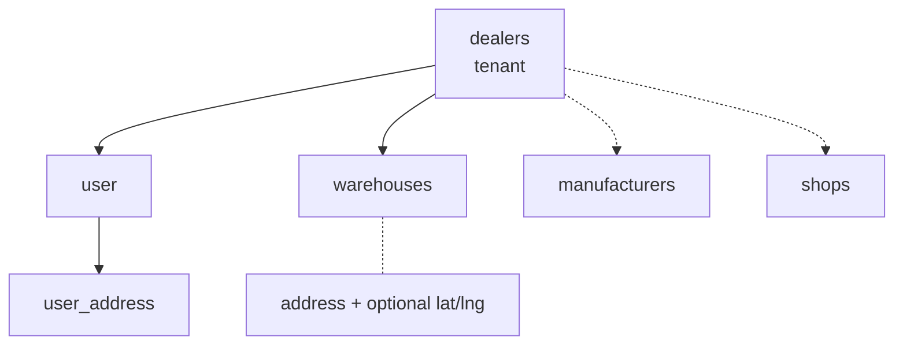
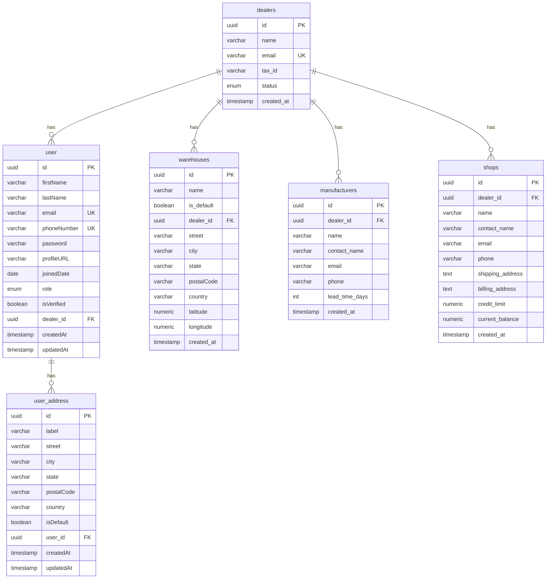

# DWMS database architecture

**As of:** 5 September 2026  
**Database:** PostgreSQL 15 (TypeORM, `synchronize: false`)  
**Tenancy model:** one dealer (tenant) owns users, warehouses, manufacturers, and shops

This document covers **deployed tables** and the **agreed CRM schema** (`manufacturers`, `shops`). Inbound/outbound/inventory (POs, GRN, SOs, stock) are still product spec only.

---

## Overview

DWMS is a multi-tenant dealer system. The tenant root is `dealers`. Registration creates:

1. A `dealers` row  
2. The first `user` (`SUPER_ADMIN`) with `dealer_id` set  
3. A default `warehouses` row named `Main Warehouse`

Later `GET /users` is scoped by `dealer_id` from the JWT. Addresses are optional and attached to a user after onboarding.

Manufacturers (inbound suppliers) and shops (outbound retail clients) are **two tables**, not one `customers` table with a type enum. Type is the table. Enums stay on `user.role` (same person, different permission).

## Database diagram

Relationship view (tenant at the centre). Solid boxes are **deployed**; dashed labels are **agreed, not migrated**.



Column-level ERD:



---

## Tenancy and relationships

| From | To | Cardinality | FK column | On delete |
|------|----|-------------|-----------|-----------|
| `user` | `dealers` | many → one | `user.dealer_id` | NO ACTION |
| `warehouses` | `dealers` | many → one | `warehouses.dealer_id` | **CASCADE** |
| `manufacturers` | `dealers` | many → one | `manufacturers.dealer_id` | **CASCADE** |
| `shops` | `dealers` | many → one | `shops.dealer_id` | **CASCADE** |
| `user_address` | `user` | many → one | `user_address.user_id` | NO ACTION |

- Deleting a dealer **does not** cascade to users (FK `NO ACTION`).
- Deleting a dealer **does** delete that dealer’s warehouses, manufacturers, and shops.
- `user.dealer_id` is nullable in the schema; dealer registration always sets it. User APIs require a JWT `dealerId` and only return rows for that dealer.
- CRM rows are always scoped by `dealer_id` the same way.

**Future FKs (not created yet):** `purchase_orders.manufacturer_id → manufacturers(id)`, `sales_orders.shop_id → shops(id)`. Do not use a generic `customer_id` + type enum on orders.

---

## Tables

### `dealers`

Tenant / organization. Table name is plural (`dealers`).

| Column | Type | Constraints |
|--------|------|-------------|
| `id` | uuid | PK, `uuid_generate_v4()` |
| `name` | varchar(255) | NOT NULL |
| `email` | varchar(255) | NOT NULL, UNIQUE |
| `tax_id` | varchar(100) | nullable |
| `status` | `dealers_status_enum` | NOT NULL, default `ACTIVE` |
| `created_at` | timestamp | NOT NULL, default `now()` |

**Status enum:** `ACTIVE` \| `SUSPENDED` \| `INACTIVE`

---

### `user`

People who log in. Table name is singular (`user`) — TypeORM default.

| Column | Type | Constraints |
|--------|------|-------------|
| `id` | uuid | PK, `uuid_generate_v4()` |
| `firstName` | varchar | NOT NULL |
| `lastName` | varchar | NOT NULL |
| `email` | varchar | NOT NULL, UNIQUE |
| `phoneNumber` | varchar | UNIQUE, **nullable** |
| `password` | varchar | NOT NULL; bcrypt-hashed on insert; omitted from default SELECT |
| `profileURL` | varchar | nullable |
| `joinedDate` | date | NOT NULL (set on insert if missing) |
| `role` | `user_role_enum` | NOT NULL, default `STAFF` |
| `isVerified` | boolean | NOT NULL, default `false` (registration sets `true`) |
| `dealer_id` | uuid | FK → `dealers.id`, nullable |
| `createdAt` | timestamp | NOT NULL, default `now()` |
| `updatedAt` | timestamp | NOT NULL, default `now()` |

**Role enum:** `SUPER_ADMIN` \| `ADMIN` \| `WAREHOUSE_MANAGER` \| `STAFF` \| `DRIVER`

Dealer registration creates the first user as `SUPER_ADMIN`. Additional users created via `POST /users` inherit the caller’s `dealer_id`.

---

### `warehouses`

Physical (or logical) locations owned by a dealer.

| Column | Type | Constraints |
|--------|------|-------------|
| `id` | uuid | PK, `uuid_generate_v4()` |
| `name` | varchar(255) | NOT NULL |
| `is_default` | boolean | NOT NULL, default `false` |
| `dealer_id` | uuid | NOT NULL, FK → `dealers.id` ON DELETE CASCADE |
| `created_at` | timestamp | NOT NULL, default `now()` |

Registration inserts one row: `name = 'Main Warehouse'`, `is_default = true`.

**Location: address, not coordinates-only.** A warehouse needs a postal address (carriers, GRN, dispatch, invoices). Coordinates are optional extras for maps/routing — they are not a replacement.

Agreed columns (not migrated yet), on `warehouses` itself (one site per warehouse, not a child table):

| Column | Type | Constraints |
|--------|------|-------------|
| `street` | varchar | nullable until onboarding completes (register creates the row without an address) |
| `city` | varchar | nullable |
| `state` | varchar | nullable |
| `postalCode` | varchar | nullable |
| `country` | varchar | nullable |
| `latitude` | numeric(10, 7) | nullable |
| `longitude` | numeric(10, 7) | nullable |

Same shape as `user_address` (structured fields, not one `TEXT` blob). Fill address in-app after register. Geocode into lat/lng later if you add maps; never store coordinates without an address.

---

### `user_address`

Postal addresses for a user (not for a warehouse or dealer). Multiple rows per user; `isDefault` flags the primary one. There is no `line2` — a single `street` field.

| Column | Type | Constraints |
|--------|------|-------------|
| `id` | uuid | PK, `uuid_generate_v4()` |
| `user_id` | uuid | FK → `user.id` |
| `label` | varchar | NOT NULL (e.g. Home, Work) |
| `street` | varchar | NOT NULL |
| `city` | varchar | NOT NULL |
| `state` | varchar | NOT NULL |
| `postalCode` | varchar | NOT NULL |
| `country` | varchar | NOT NULL |
| `isDefault` | boolean | NOT NULL, default `false` |
| `createdAt` | timestamp | NOT NULL, default `now()` |
| `updatedAt` | timestamp | NOT NULL, default `now()` |

Not collected at registration.

---

### `manufacturers` (agreed — not migrated yet)

Inbound suppliers for purchase orders. Own table so POs cannot accidentally reference a shop.

| Column | Type | Constraints |
|--------|------|-------------|
| `id` | uuid | PK, `gen_random_uuid()` |
| `dealer_id` | uuid | NOT NULL, FK → `dealers.id` ON DELETE CASCADE |
| `name` | varchar(255) | NOT NULL; UNIQUE with `dealer_id` |
| `contact_name` | varchar(255) | nullable |
| `email` | varchar(255) | nullable |
| `phone` | varchar(50) | nullable |
| `lead_time_days` | int | NOT NULL, default `0` |
| `created_at` | timestamp | NOT NULL, default `now()` |

Index: `idx_manufacturers_dealer_id` on `dealer_id`.

No `type` / `role` column. Being in this table **is** the role.

---

### `shops` (agreed — not migrated yet)

Outbound retail clients for sales orders, credit, and shipping.

| Column | Type | Constraints |
|--------|------|-------------|
| `id` | uuid | PK, `gen_random_uuid()` |
| `dealer_id` | uuid | NOT NULL, FK → `dealers.id` ON DELETE CASCADE |
| `name` | varchar(255) | NOT NULL; UNIQUE with `dealer_id` |
| `contact_name` | varchar(255) | nullable |
| `email` | varchar(255) | nullable |
| `phone` | varchar(50) | nullable |
| `shipping_address` | text | NOT NULL |
| `billing_address` | text | nullable |
| `credit_limit` | numeric(12, 2) | NOT NULL, default `0.00` |
| `current_balance` | numeric(12, 2) | NOT NULL, default `0.00` |
| `created_at` | timestamp | NOT NULL, default `now()` |

Index: `idx_shops_dealer_id` on `dealer_id`.

No `type` / `role` column. Being in this table **is** the role.

A unified “Customers” UI can use a **view** (`UNION ALL` of both tables with a `kind` column). Do not merge into one physical table. Split apps later: manufacturer portal owns `manufacturers`; shop portal owns `shops`; dealer WMS uses both.

**Later (not v1):** structured addresses (like `user_address`) instead of a single `TEXT` field; a balance ledger instead of only mutating `current_balance`.

---

## Why not one `customers` table + enum

`user.role` is an enum because every user is the same entity (same columns, login, dealer). Manufacturer vs shop is two entities: different required fields, opposite warehouse flows (inbound vs outbound), and different FKs. A single table would force nullable credit/lead-time/shipping columns and make it possible for a PO to point at a shop.

---

## PostgreSQL types (enums)

| Type | Values |
|------|--------|
| `dealers_status_enum` | `ACTIVE`, `SUSPENDED`, `INACTIVE` |
| `user_role_enum` | `SUPER_ADMIN`, `ADMIN`, `WAREHOUSE_MANAGER`, `STAFF`, `DRIVER` |

Extension: `uuid-ossp` (for `uuid_generate_v4()`).

---

## What is not in Postgres

| Store | Purpose |
|-------|---------|
| Redis | Refresh-session hash (`refresh:user:{userId}`), password-reset jti |

JWT access/refresh tokens are not stored as rows. Access token payload includes `sub`, `dealerId`, `role`.

---

## Migrations (apply order)

1. `CreateUsers` — table `user`  
2. `Adding_UserRole` — role column (later replaced by string enum)  
3. `adding_user_addresses` — table `user_address`  
4. `AddingUserIsVerified` — `isVerified`  
5. `CreateDealers` — table `dealers` + status enum  
6. `UpdateUserRoles` — `user_role_enum` (`SUPER_ADMIN` … `DRIVER`)  
7. `AddUserDealerId` — `user.dealer_id`  
8. `SimplifyUserAddress` — `line1` → `street`, drop `line2`  
9. `CreateWarehouses` — table `warehouses`  
10. *(pending)* Create `manufacturers` and `shops`  
11. `UserPhoneNumberNullable` — `user.phoneNumber` optional  

Run with `npm run migration:run` (builds `dist/` first). Schema sync is off.

---

## Runtime write path (register)

```
BEGIN
  INSERT dealers
  INSERT user (role = SUPER_ADMIN, dealer_id, isVerified = true)
  INSERT warehouses (name = 'Main Warehouse', is_default = true, dealer_id)
COMMIT
```

If any step fails, the transaction rolls back. Tokens are issued after commit.

---

## Planned / not implemented as tables

These exist in product docs (`docs/image.png`, BRD) or as TypeScript enums only. **No tables yet:**

- Purchase orders, GRN, backorders  
- Sales orders, allocation, pick/pack/dispatch  
- Inventory / stock ledger / movements  
- Payments, shipping, audit logs  

Enums already in code (unused by schema): `OrderStatus`, `PaymentStatus`, `ShippingStatus`, `PaymentProvider`, `AuditAction`.

---

## Entity source files

| Table | Entity |
|-------|--------|
| `dealers` | `src/dealers/entities/dealer.entity.ts` |
| `user` | `src/users/entities/user.entity.ts` |
| `warehouses` | `src/warehouses/entities/warehouse.entity.ts` |
| `user_address` | `src/user-addresses/entities/user-address.entity.ts` |
| `manufacturers` | *(not implemented)* |
| `shops` | *(not implemented)* |
